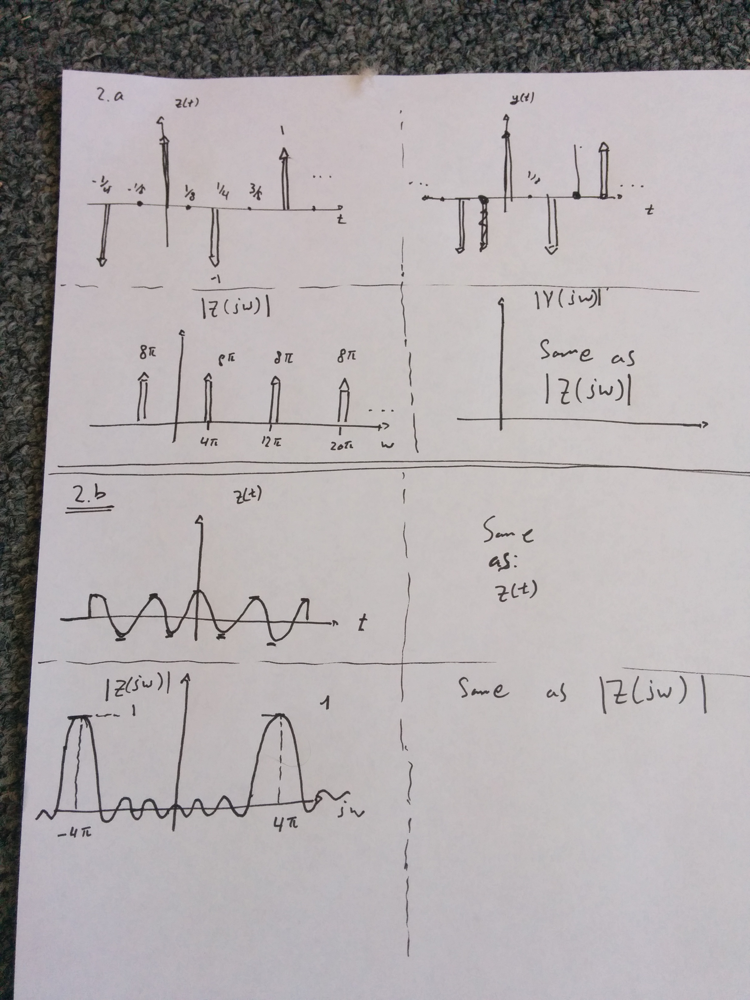
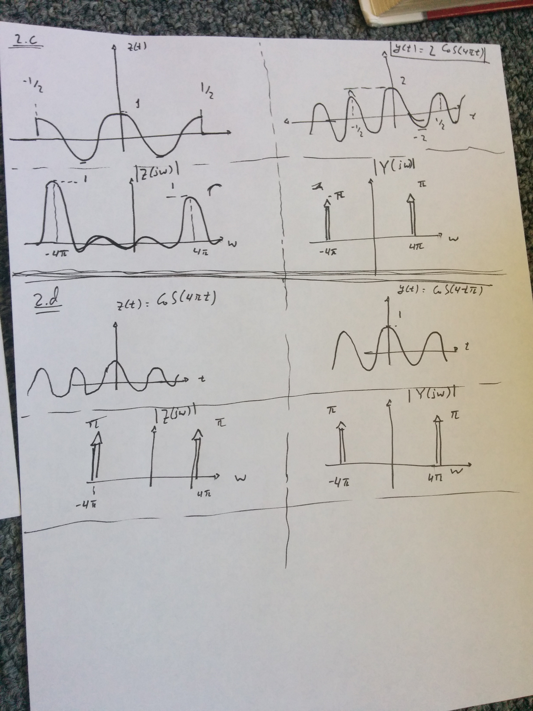

<!--
The latex template is in default.latex.

To render to PDF, install pandoc and latex. Then, run make.
-->
2)  Diagrams:

    
    

3)  a.  \begin{align*}
            h_{lp}\left(t\right) &= 
                F^{-1}_t\left\{
                    \Pi\left(\frac{w}{2 \pi 1000}\right)
                \right\} \\
            &= \frac{1}{2 \pi} 
                \int^{\infty}_{-\infty} 
                    \Pi\left(\frac{w}{2 \pi 1000}\right) 
                    e^{j w t} 
                dw \\ 
            &= \frac{1}{2 \pi}
                \int^{\pi 1000}_{-\pi 1000} e^{jwt} dw \\ 
            &= \frac{1}{2\pi} 
                \left(\frac{
                    e^{jt 1000 \pi} - 
                    e^{-jt 1000 \pi}
                }{jt}\right) \\
            &= \boxed{
                    \frac{\sin\left(1000 \pi t\right)}{\pi t}
                }
        \end{align*}
    
    b.  \begin{align*}
            h_{win} &= F_w\left\{
                    \Pi\left(\frac{t}{0.004}\right) 
                    h_lp\left(t\right)
                \right\} \\
            &= \frac{1}{2 \pi} 
                F_w\left\{
                    \Pi\left(\frac{t}{0.004}\right)
                \right\} * 
                F_w\left\{
                    h_lp\left(t\right)
                \right\} \\
            &= \frac{1}{2 \pi} 
                \left(\Pi\left(\frac{w}{2 \pi 1000}\right)\right) * 
                \left(\frac{2 \sin\left(0.002 w \right)}{w}\right)
        \end{align*}

